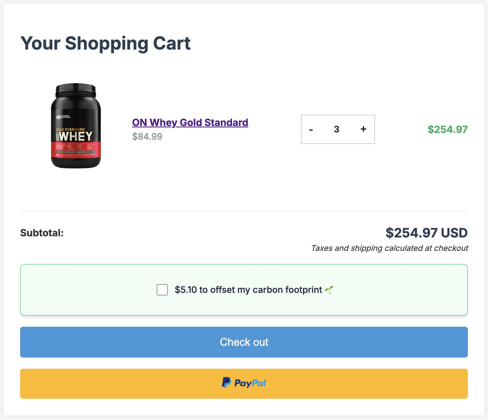
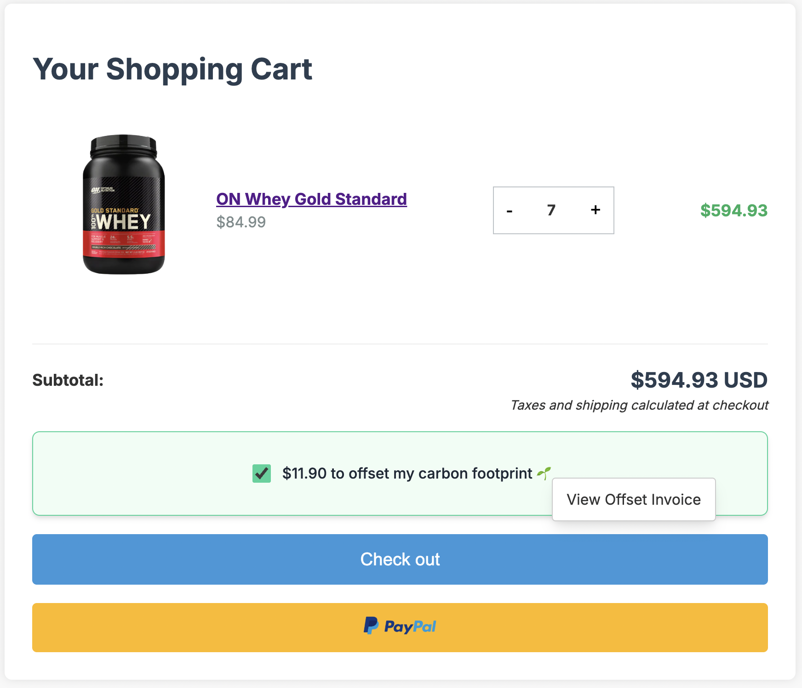
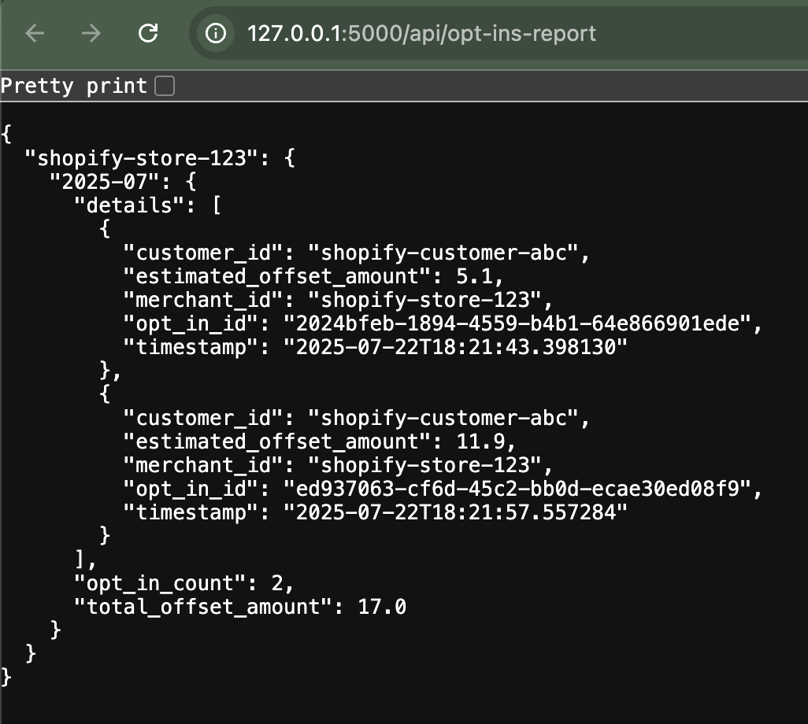

# 🌱 Carbon Offset Estimator & Widget

This is a **minimal full‑stack prototype** built as part of a take‑home assessment.  
It demonstrates how a Shopify store could offer customers the option to **offset the carbon footprint of their cart**.

---

## ✨ Features

✅ **Embeddable Widget (Stencil.js)**  
- Injected into a merchant’s cart page via a `<script>` tag.  
- Fetches widget configuration (placement & verbiage) from backend.  
- Displays a button for the customer to opt in to offset their order’s footprint.  
- On opt‑in, sends cart data to backend to estimate carbon offset and thanks the user.

✅ **Backend API (Python + Flask)**  
- **`/widget-config`** – returns JSON configuration for placement and button text.  
- **`/estimate-offset`** – receives cart data (e.g., product prices) and returns a simple offset calculation (`total_price * 0.02`).  
- **`/track-optin`** – tracks opt‑ins and estimated offsets in memory for later reporting. (to 
  see the offset reporting functionality, right-click on the widget)

**_APIs are written using `RXJS` to be more reactive and composable._

✅ **CORS Enabled**  
- Configured via `flask-cors` to allow requests from the frontend development server.

---

## 🏗️ Tech Stack

- **Frontend:** [Stencil.js](https://stenciljs.com/) (Web Component)
- **Backend:** [Python Flask](https://flask.palletsprojects.com/)

---

## 📂 Project Structure

```text
carbon-offset-estimator-widget/
├── .stencil/                                                   # Stencil internal build artifacts
├── dist/                                                       # Compiled build output
├── eco-cart-carbon-footprint-estimator-widget/
├── loader/                                                     # Loader script for embedding
├── node_modules/                   
├── src/                            
│   ├── assets/                                                 # Static assets like images
│   │   ├── gold_standard_whey.png
│   │   └── paypal-logo.png
│   ├── components/
│   │   └── carbon-offset-estimator/
│   │       ├── carbon-offset-estimator.tsx                     # Widget component
│   │       ├── carbon-offset-estimator.css                     # Component-specific styles
│   │       └── test/                                           # Unit / component tests
│   ├── demos/                                                  # Demo Scripts & Styles
│   │   ├── scripts.js
│   │   └── styles.css
│   ├── global/styles/                                          # Global CSS styles
│   │   ├── _common.css
│   │   ├── _mixins.css                                         
│   │   └── _variable.css
│   ├── server/                                                 # Python/Flask Server (APIs)
│   │   ├── configs/                                            # Widget Configs that client can customize
│   │   │   ├── eco_cart_dev-1.0.i18n.en_us.json                
│   │   │   └── eco_cart_test-3.0.i18n.en_us.json
│   │   └── app.py                                              # Flask app (APIs: config, estimate, opt-in)
│   ├── services/                                               # Frontend Services
│   │   ├── config/config.service.ts                            # Service to fetch widget config
│   │   ├── http/httpService.ts                                 # Service with generic HTTP methods
│   │   └── offset/offset.service.ts                            # Service to estimate carbon offset
│   ├── utils/                                   
│   └── index.html
├── www/                                                        # Local Test Entry
├── .editorconfig
├── .gitignore
├── .prettierrc.json
├── LICENSE
├── package.json
├── package-lock.json
├── readme.md
├── stencil.config.ts
└── tsconfig.json
```

### ✨ Key Highlights
- **`src/components/carbon-offset-estimator`** : Core Stencil component for the widget UI and interaction logic.

- **`src/server/app.py`** : Minimal Flask backend providing widget config, offset estimation, and opt‑in tracking APIs.

- **`src/services`** : Frontend service layer handling data fetching and API communication.

- **`global/styles`** : Shared CSS variables, mixins, and common styles used throughout the component. **_with style externalization, client can inject their own styles to customize the widget_**.

- **`demos`** : Simple demo scripts and styles to test the widget in isolation.

- **`dist` & `www`** : Generated output after running `npm run build`, used for deployment or embedding.

---

## 💡 Assumptions

- Cart data is mocked in the prototype (replace with real cart payload in production).
- Offset calculation is a simple 2% of the subtotal price (replace with real carbon calculation logic).
- Opt‑ins are stored in memory for simplicity (replace with DB for production).
- Basic configuration is fetched from backend (extendable for dynamic placement or A/B tests).

---

## 🚀 Running Locally

### Run Frontend & Backend Together
```bash
npm install
npm run start # Starts both frontend and backend servers
```

### Run Frontend Separately
```bash
npm install
npm run start-stencil
```

### Run Backend Separately
```bash
cd server
pip install flask flask-cors
python app.py
```

### To Embed Widget
```html
<script type="module" src="https://your-cdn-or-server.com/build/carbon-offset-estimator.esm.js"></script>
<script nomodule src="https://your-cdn-or-server.com/build/carbon-offset-estimator.js"></script>

<carbon-offset-estimator></carbon-offset-estimator>
```

### Screenshots



